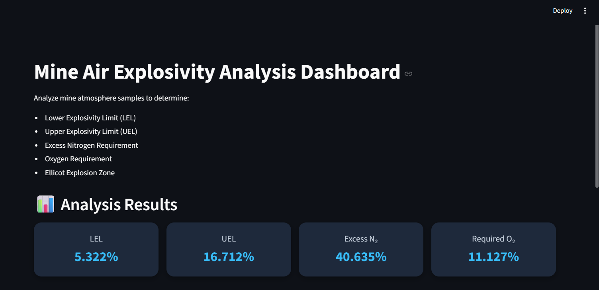
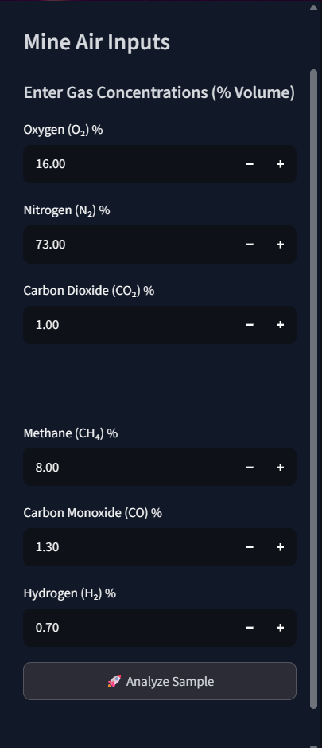
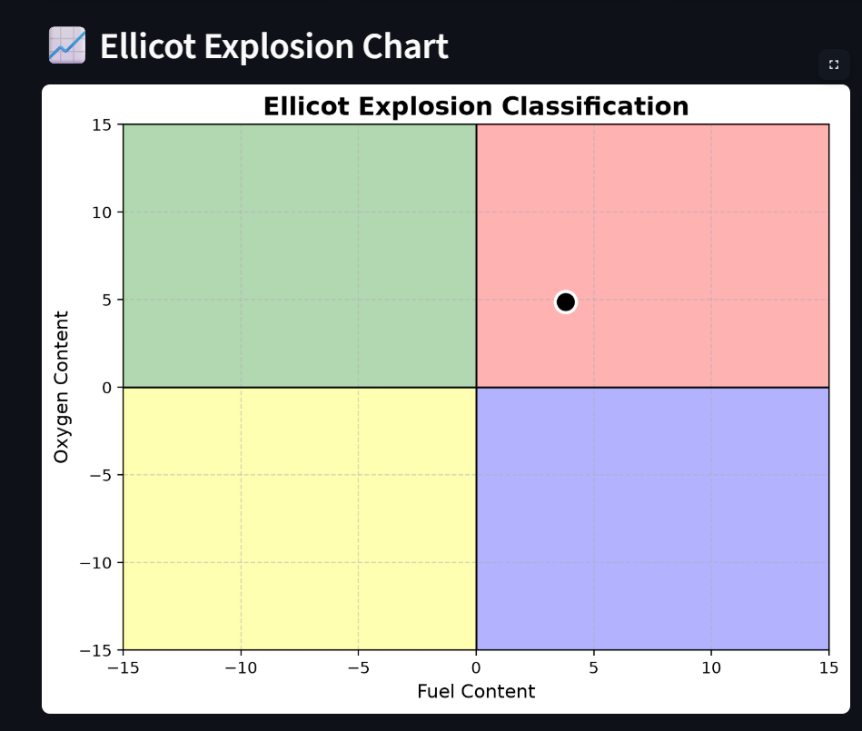
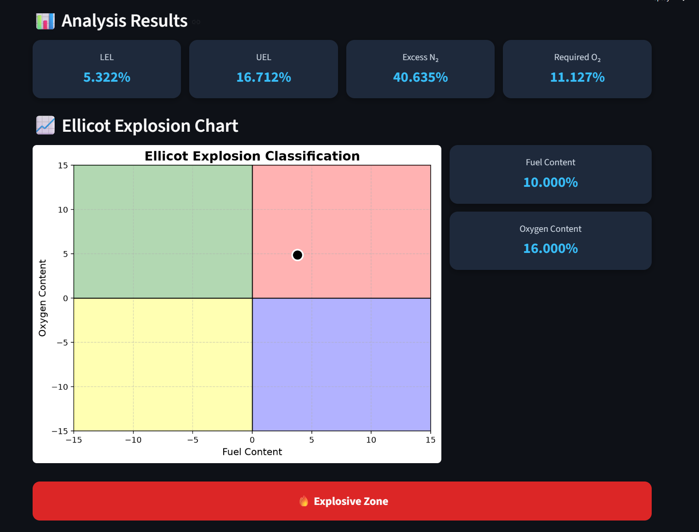

# ⛏️ Mine Air Explosibility Dashboard


An interactive **Streamlit-based web application** for analyzing the explosibility of mine atmospheres using the **Ellicott Explosion Diagram**. The dashboard computes important explosibility parameters, visualizes the Ellicott Explosion Diagram, and classifies mine atmospheres into different safety zones based on gas composition.

---

## 📖 Project Overview

Underground coal mines are highly susceptible to explosions caused by combustible gases such as **Methane (CH₄)**, **Carbon Monoxide (CO)**, and **Hydrogen (H₂)**. Rapid and accurate assessment of mine atmosphere is essential for ensuring worker safety.

This project digitizes the traditional **Ellicott Explosion Diagram** into an interactive Streamlit dashboard. Users can enter mine gas concentrations, instantly perform explosibility analysis, visualize the Ellicott Diagram, and classify the mine atmosphere into safe or hazardous zones.

The project was developed as an academic application in **Mine Safety Engineering** to provide an accessible computational implementation of the Ellicott Explosion Diagram for students, researchers, and mining professionals.

---

## 📸 Application Screenshots

### 🏠 Home Page



---

### 📥 Input Section



---

### 📈 Ellicott Diagram



---

### 📊 Results



---

## ✨ Features

- Interactive Streamlit Dashboard
- Real-time Mine Air Explosibility Analysis
- Automatic calculation of:
  - Lower Explosive Limit (LEL)
  - Upper Explosive Limit (UEL)
  - Minimum Burning Limit (MBL)
  - Excess Nitrogen Requirement
  - Oxygen Concentration at Minimum Burning Limit
- Ellicott Explosion Diagram Visualization
- Automatic Explosibility Zone Classification
- Clean and user-friendly interface

---

## 🛠️ Technology Stack

- Python
- Streamlit
- NumPy
- Matplotlib
- Git & GitHub

---

## 📂 Repository Structure

```text
mine-air-explosibility-dashboard/
│
├── screenshots/
│   ├── home_page.png
│   ├── input_section.png
│   ├── ellicott_diagram.png
│   └── results.png
│
├── ellicott_diagram.py
├── requirements.txt
├── Mine_Air_Explosivity_Paper.pdf
├── README.md
├── LICENSE
├── .gitignore
└── venv/ (ignored)
```

---

## 🚀 Installation

### Clone the repository

```bash
git clone https://github.com/Swasti-sn245/mine-air-explosibility-dashboard.git
```

### Navigate to the project directory

```bash
cd mine-air-explosibility-dashboard
```

### Create a virtual environment

```bash
python -m venv venv
```

### Activate the virtual environment

**Windows (Command Prompt)**

```bash
venv\Scripts\activate
```

**Git Bash**

```bash
source venv/Scripts/activate
```

### Install the required dependencies

```bash
pip install -r requirements.txt
```

---

## ▶️ Running the Application

Start the Streamlit application using:

```bash
streamlit run ellicott_diagram.py
```

The dashboard will open automatically in your default browser.

```
http://localhost:8501
```

---

## 🧪 Methodology

The dashboard performs explosibility analysis based on well-established mine safety principles, including:

- Le Chatelier's Mixing Rule
- Ellicott Explosion Diagram
- Minimum Burning Limit Calculations
- Oxygen Concentration Analysis
- Excess Nitrogen Requirement

---

## 📄 Research Paper

This repository also includes the accompanying research paper:

**📘 Mine_Air_Explosivity_Paper.pdf**

The paper discusses:

- Theoretical background of mine atmosphere explosibility
- Mathematical formulation of the Ellicott Explosion Diagram
- Implementation methodology
- Practical applications in Mine Safety Engineering

---

## 🎯 Applications

- Underground Coal Mine Safety
- Mine Safety Engineering
- Explosion Hazard Assessment
- Mining Research
- Engineering Education
- Safety Training

---

## 🌐 Live Demo

A live deployment is planned for a future release.

---

## 🔮 Future Improvements

Future enhancements may include:

- Interactive Plotly-based visualization
- Real-time gas sensor integration
- Automatic PDF report generation
- Historical gas trend analysis
- Machine Learning-based explosion risk prediction
- Support for additional explosibility diagrams

---

## 📚 References

- Matei et al. (2020), *Use of Explosibility Diagrams in Potentially Explosive Atmospheres*
- Mashuga & Crowl, *Le Chatelier's Mixing Rule for Flammable Limits*
- Coward & Jones, *Limits of Flammability of Gases and Vapours*
- Streamlit Documentation
- NumPy Documentation
- Matplotlib Documentation

---

## 👨‍💻 Author

**Swasti Sundar Nath**

**B.Tech, Mining Engineering**

**Indian Institute of Technology (Indian School of Mines), Dhanbad**

### Research Interests

- Artificial Intelligence
- Machine Learning
- Mine Safety Engineering
- Intelligent Mining Systems
- Mine Fire & Explosion Analysis

---

## 🙏 Acknowledgements

This project was inspired by classical mine safety literature on explosibility analysis and developed as an academic effort to provide an accessible computational implementation of the Ellicott Explosion Diagram.

Special thanks to the researchers and authors whose work on mine safety and explosion analysis laid the foundation for this implementation.

---

## ⭐ Support

If you found this project useful, please consider giving it a **Star ⭐** on GitHub.

Contributions, suggestions, and constructive feedback are always welcome.

---

**Thank you for visiting this repository!**